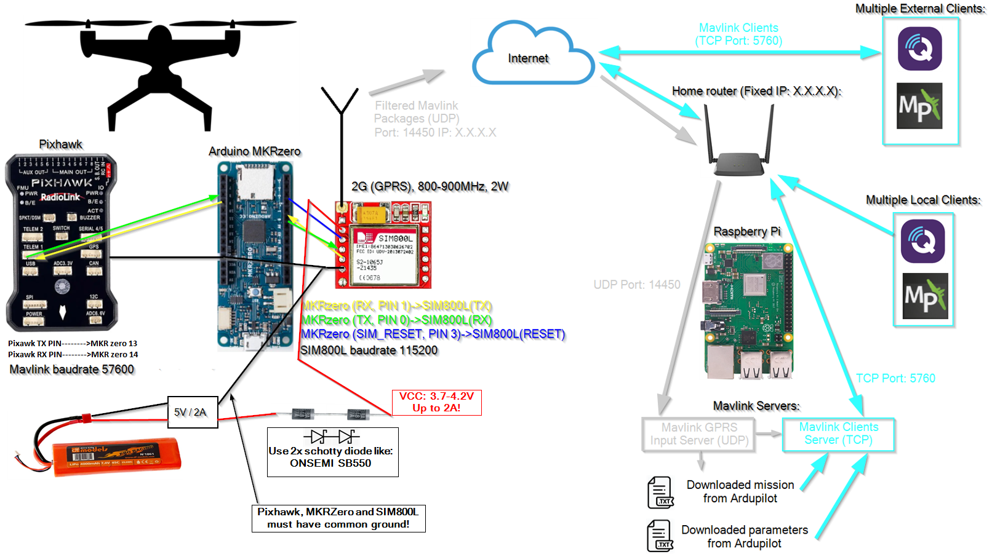

# Mavlink Ardupilot Telemetry via GPRS (2G) with multiple client support:

# Introduction
As an alternative to having a high power long range telemetry link, I wanted to try and relay data via a simple GPRS link using a simple cheap SIM800L module. Since these opprates at ~850MHz with a power ouput up to 2W, it should have plenty of range and bandwith if you fly where there is Telecom coverage.

# Features (Drone side):
The Arduino MKRZero has the task of recieving Mavlink packages from the Ardupilot and relay them to the Raspberry Pi via GPRS. It also implemnts a package filter on the mavlink data from the Ardupilot to ensure only relevant packages are relayed in order to limit the bandwith usages or handle them ie. RSSI injection.
>**NOTE:** Packages with RSSI from Ardupilot is intercepted by the Arduino and replace the RSSI value with the 2G GPRS RSSI before it is relayed to the server. This will make the RSSI inducator on the groundstation indicate the GPRS link RSSI and not the RC link RSSI.  
  
	// RSSI from SIM800L is:    
	// 0 -> -115dBm  
	// 1 -> -111dbm  
	// 2-30 -> -110 to -54dbm  
	// 31 -> -52dBm or greater  
	// 99 Unknown  
	
	/* This will be translated to RSSI in % for Mavlink:
	RSSI value:31 Gives:254 Which is 100%  
	RSSI value:30 Gives:246 Which is 97%  
	RSSI value:29 Gives:239 Which is 94%  
	RSSI value:28 Gives:231 Which is 91%  
	RSSI value:27 Gives:224 Which is 88%  
	RSSI value:26 Gives:217 Which is 85%  
	RSSI value:25 Gives:209 Which is 82%  
	RSSI value:24 Gives:202 Which is 79%  
	RSSI value:23 Gives:195 Which is 76%  
	RSSI value:22 Gives:187 Which is 73%  
	RSSI value:21 Gives:180 Which is 70%  
	RSSI value:20 Gives:172 Which is 68%  
	RSSI value:19 Gives:165 Which is 65%  
	RSSI value:18 Gives:158 Which is 62%  
	RSSI value:17 Gives:150 Which is 59%  
	RSSI value:16 Gives:143 Which is 56%  
	RSSI value:15 Gives:136 Which is 53%  
	RSSI value:14 Gives:128 Which is 50%  
	RSSI value:13 Gives:121 Which is 47%  
	RSSI value:12 Gives:113 Which is 44%  
	RSSI value:11 Gives:106 Which is 41%  
	RSSI value:10 Gives:99 Which is 39%  
	RSSI value:9 Gives:91 Which is 36%  
	RSSI value:8 Gives:84 Which is 33%  
	RSSI value:7 Gives:77 Which is 30%  
	RSSI value:6 Gives:69 Which is 27%  
	RSSI value:5 Gives:62 Which is 24%   
	RSSI value:4 Gives:54 Which is 21%  
	RSSI value:3 Gives:47 Which is 18%  
	RSSI value:2 Gives:40 Which is 15%  
	RSSI value:1 Gives:32 Which is 12%  
	RSSI value:0 Gives:25 Which is 10%

# Features (Ground side):
On the ground everything is handled by the MavlinkServer program, which can be build for both linux or Raspberry Pi. The server is connected to the internet via my home router. The Pi has two servers running:
1. GPRS server for UDP data to and from the Drone.
This will listen for Mavlink UDP data sent from the drone via onboard Arduino. It will also download and save all drone parameters and mission waypoints each time the it detectes a boot on the drone. This will only be done once per drone reboot, and thus clients (Qgroundcontrol/mission planner) connecting to the server will get data download ensuring not to load the drone.
All data recieved from the drone is relayed to all clients connected, but no clients have write access to drone.
The downloaded data from drone will be saved in [DATE_TIME]-Parameters.txt and [DATE_TIME]-Waypoints.txt - The client must then do a reconnect to get the updated values (disconnect/connect). This ensures the server can run 24/7 allways ready.

2. Client server for handling multiple clients (Qgroundcontrol / Mission Planner).
The Client server listens for Qgroundcontrol / Mission PLanner TCP connection on port 5760 (and when connection will negotiate another port for data). I found UDP packages from my router to a client on 4G is not working and thus only TCP should be used.
When clients connect, they think they are connected to a drone (Ardupilot) and thus will ask for parameters and mission waypoints which the server will provide given the GPRS server has made them available. 

# How to Build

## Arduino MKRZero
Download the Arduino files and put the Libary folder in the Arduino Libary folder. Open the Arduino Sketch and change the SIM800L line to match your SIM APN and the IP to your fixed IP for the home router: 
`SIM800L ModemGPRS(&Serial3, 115200, PIN_SIM800L_RESET, "", "[SIM APN]", "[IP FOR HOME ROUTER]", 14450, "UDP", 100, 2000);`  
This could be:  
`SIM800L ModemGPRS(&Serial3, 115200, PIN_SIM800L_RESET, "", "internet", "10.11.12.13", 14450, "UDP", 100, 2000);`  
>**NOTE:** Ensure the SAMD liberies are installed and the sketch sould now build and upload to the ArduinoMKRZero.

>**NOTE:** The defualt baudrate on SIM800L is 9600, this must be changed to 115200!.
> This can be done with "AT+IPR=115200" and then "AT&W" if settings is lost after reboot.

## Mavlink Server
Download the source to the Raspberry Pi (standard Buster image) or Linux (Ubuntu 20.03) using git clone:  
`git clone https://github.com/KenLagoni/MavlinkGPRS.git`  

Build the program by running the build script:  
 `cd MavlinkGPRS && ./build.sh`  

### Starting the server

Starting the Mavlink GPRS server using default values:  
 `./MavlinkGPRSServer`  
 This will listen for UDP data from drone on port 14450 and accept MP or QGC on TCP port 5760 and it will not download parameters from the drone, but in stead load the default parameters 1086 from Arduplane v4.0.9.
  
  
Starting the Mavlink GPRS with custom ports:  
 `./MavlinkGPRSServer -i 25000 -c 58000`  
This will listen for UDP data from drone on port 25000 and accept MP or QGC on TCP port 58000. It will use default parameters.
  
  
Starting the Mavlink GPRS and download parameters from drone:  
 `./MavlinkGPRSServer -w parameters.txt`  
It will download all parameters and save them to parameters.txt. (this can take a while 2-10min).  

Starting the Mavlink GPRS and load parameters from download file:  
 `./MavlinkGPRSServer -r parameters.txt`  
This will load all Parameters from input file.  

Starting the Mavlink GPRS with custom ports and load parameters from download file:  
 `./MavlinkGPRSServer -i 25000 -c 58000 -r parameters.txt`  

>**NOTE:** 
>Waypoint / mission will allways be downloaded and saved to a file DAY-MON-YEAR-HOUR-MIN-SEC-waypoint.txt

